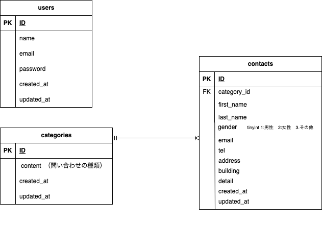

# お問い合せフォーム

##　環境構築

Dockerビルド
1. git clone
2. docker-compose up -d --build

*MySQLは、OSによって起動しない場合があるのでそれぞれのPCに合わせてdocker-compose.ymlファイルを編集してください。

## Laravel環境構築

1. docker-compose exec php bash
2. composer install
3. cp .env.example .env　（.env.exampleファイルから.envを作成）
　　環境変数を変更　
      DB_CONNECTION=mysql
      DB_HOST=mysql
      DB_PORT=3306
      DB_DATABASE=laravel_contact
      DB_USERNAME=laravel_user
      DB_PASSWORD=laravel_pass
4. php artisan key:generate
5. php artisan migrate
6. php artisan db:seed

## 使用技術

フロントエンド：HTML / CSS / Blade
バックエンド：PHP 8.1.33 / Laravel 8.83.8
データベース： MySQL
開発環境：Docker / Docker Compose

## ER図

## URL
・開発環境：　http://localhost/
・phpMyAdmin: http://localhost:8082/

